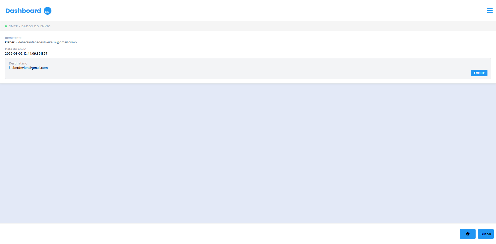

# 📧 app-smtp-ss

Sistema de monitoramento e log para envios **SMTP**. Esta aplicação permite visualizar de forma clara os dados de envios realizados, incluindo remetente, destinatário e o timestamp preciso de cada operação.

---

## 📸 Demonstração da Interface

O projeto conta com um design limpo e adaptável para diferentes tamanhos de tela.

### 📱 Visualização Mobile
Como visto na interface atual, os dados são organizados verticalmente para facilitar a leitura em dispositivos móveis, apresentando blocos de informações claros e o botão de ação destacado.

  

### 🖥️ Visualização Desktop
Na versão para computadores, a interface se expande horizontalmente, permitindo uma visualização mais ampla dos logs e do menu de navegação lateral ou superior.

  

---

## 🛠️ Detalhes do Projeto

Com base na estrutura do `ui-app`, o sistema foca em:

- **Dashboard Principal:** Exibição do "Status do Envio".
- **Dados Coletados:**
  - **Remetente:** Nome e e-mail de origem.
  - **Data do envio:** Registro com precisão de milissegundos.
  - **Destinatário:** E-mail de destino.
- **Ações:** Opção de excluir logs diretamente da interface.

---

## 🚀 Como Visualizar

1. Clone o repositório: `git clone https://github.com`
2. Navegue até a pasta: `cd ui-app`
3. Abra o arquivo principal no seu navegador para ver a responsividade em ação.

---

  Mantido por <a href="https://github.com">Kleber Devion</a>

